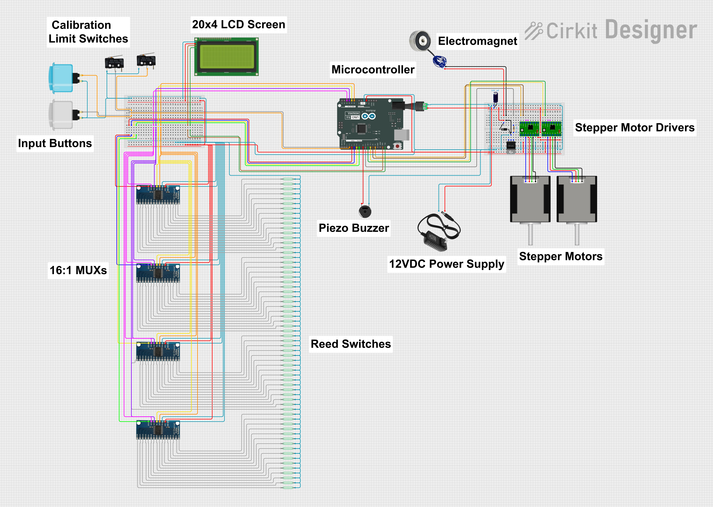

# ChessConnect

A self-contained physical chess board that lets a local player face any Lichess.org
opponent over the internet, with both players' moves relayed to the physical board
in real time.

Senior capstone project at the University of Pittsburgh at Johnstown, 2024–2025.

https://github.com/user-attachments/assets/ddd3d065-473c-4527-940a-21a858fc336b

*Live demo at the University of Pittsburgh at Johnstown Senior Capstone Showcase — Joseph and Brendan walk through the system while playing a live game (Joseph on the physical board, Brendan on Lichess).*

## What It Does

ChessConnect combines a traditional wooden chess board with an internal
Cartesian gantry and electromagnet, allowing a local player to physically move
pieces against a remote opponent playing over Lichess.org — with no additional
software required on the remote player's end.

* The **local player** moves pieces normally. Reed switches under every square
detect the moves; the Arduino interprets them and sends them to Lichess.
* The **remote player** moves in their Lichess app or browser. When their move
arrives, the internal XY gantry positions an electromagnet under the piece,
turns on, drags the piece to its destination, and turns off.
* The **LCD screen** displays the in-game clock, current game status, and
handles the game setup UI (opponent selection, time controls, etc.).
* The system operates as a standalone device — once linked to a Lichess
account and connected to WiFi, it needs no external computer, phone, or app.

## Photos

|||
|-|-|
|||
|External playing view|Internal cabinet with XY gantry, electromagnet, and reed switch matrix|

## System Overview



### Key Components

|Component|Role|
|-|-|
|Arduino Uno R4 WiFi|Main microcontroller — inputs, game logic, Lichess API integration|
|Reed switch matrix (8×8)|Detects piece presence on each square via magnets in each piece base|
|4× 16:1 analog multiplexers|Read the 64 reed switches with a small pin budget|
|XY stepper gantry|Positions the electromagnet beneath the board|
|Electromagnet (TIP120 BJT drive)|Attracts pieces from below for automated moves|
|2× stepper drivers + steppers|Drive the X and Y axes of the gantry|
|20×4 LCD|Game setup UI, clock display, status messages|
|Limit switches|Homing and calibration for the gantry|
|Push buttons|User input for menu navigation|

Full block diagram and component descriptions in the capstone poster
([media/poster.pdf](media/poster.pdf)).

## Repository Structure

```
chessconnect/
├── README.md
├── .gitignore
├── firmware/
│ ├── chessconnect.ino
│ ├── secrets.h.example
│ └── secrets.h (local file, gitignored)
├── media/
│ ├── topdown-view.jpg
│ ├── internal-view.jpg
│ ├── circuit-diagram.png
│ └── poster.pdf
├── hardware/
│ └── models/
│ ├── stl/
│ │ ├── king.stl
│ │ ├── queen.stl
│ │ ├── rook.stl
│ │ ├── bishop.stl
│ │ ├── knight.stl
│ │ └── pawn.stl
│ └── fusion/
│ ├── king.f3d
│ └── ...
└── docs/
├── design-report.pdf
├── functional-requirements.pdf
├── testing-and-analysis.pdf
├── final-report.pdf
└── final-presentation.pdf
```

## Piece Fabrication

The playing pieces are 3D-printed from custom CAD models designed in Fusion 360.
Each piece has an embedded neodymium magnet in its base to interact with the
reed switches and be moved by the internal electromagnet.

CAD source files and print-ready STLs are in [`hardware/models/`](hardware/models/).

https://github.com/user-attachments/assets/cc7fb758-c390-4b25-9f52-523a92acfec9

## Firmware

The main firmware lives in [`firmware/chessconnect.ino`](firmware/chessconnect.ino).
It runs on an Arduino Uno R4 WiFi and handles:

* Setup and calibration of the XY gantry via limit switches
* Reed switch matrix scanning through four 16:1 muxes to detect piece positions
* Internal chess board state tracking and legal move interpretation
* Lichess REST API integration for game creation, move submission, and game
state streaming (`/api/challenge/`, `/api/board/game/`, `/api/board/game/stream/`)
* Motor control routines for file, rank, and diagonal moves via the AccelStepper
library, including special-case handling for castling and en passant
* LCD UI for game setup (opponent selection, time controls) and in-game display
(clock, status, error messages)
* Electromagnet control via a TIP120 BJT driver

### Building and Running

The firmware requires several Arduino libraries:

* **WiFiS3** and **WiFiSSLClient** — Arduino Uno R4 WiFi networking
* **ArduinoJson** — parsing Lichess API responses
* **LiquidCrystal_I2C** — 20×4 LCD control
* **AccelStepper** — stepper motor control with acceleration profiles
* **Wire** — I²C for the LCD

Before building:

1. Copy `firmware/secrets.h.example` to `firmware/secrets.h`
2. Fill in your WiFi SSID, WiFi password, and Lichess personal API token
(create a token at https://lichess.org/account/oauth/token with scopes
`challenge:read`, `challenge:write`, `board:play`)
3. Open the sketch in the Arduino IDE and upload to an Arduino Uno R4 WiFi

`secrets.h` is gitignored — it will not be tracked by git or pushed to any
public repository.

## Validation

ChessConnect was validated against a set of functional requirements defined
during the design phase. Testing included:

* Full games played against Lichess opponents (both human and bot), with
dozens of complete games recorded during system testing
* Verification of all special moves (castling, en passant, promotion)
* Board calibration procedures across multiple power cycles
* Error handling for illegal moves and mid-game piece disruption
* Automated piece movement speed verification (below)

https://github.com/user-attachments/assets/c93962c8-b26c-460b-896f-1c7d04267033

*Piece movement speed verification: an automated capture demonstrating the XY gantry, electromagnet timing, and post-move board state recognition. Used to verify the piece movement speed functional requirement.*

Full validation results in [`docs/testing-and-analysis.pdf`](docs/testing-and-analysis.pdf).
The complete project write-up, including background, design decisions, and outcomes, is in [`docs/final-report.pdf`](docs/final-report.pdf).

## Team

ChessConnect was developed as a senior capstone project by
**Joseph Denk** and **Brendan Jugan**, advised by Dr. Laura Wieserman,
at the University of Pittsburgh at Johnstown (2024–2025).

**Contribution breakdown:**

* **Joseph Denk** (this repository owner): Hardware design and fabrication —
board construction, circuit design and assembly, component selection and
specification, breadboard prototyping, mechanical integration. Firmware
contributions including architectural and program-flow input and
implementation of specific subsystems.
* **Brendan Jugan**: Primary firmware development, Lichess.org API integration,
game state management, and user interface logic.

Both team members contributed to overall system design, testing and
validation, and documentation.

## Documentation

The [`docs/`](docs/) folder contains the full set of project deliverables:

- [`design-report.pdf`](docs/design-report.pdf) — pre-build design phase report covering
  system architecture, component selection, and initial design decisions
- [`functional-requirements.pdf`](docs/functional-requirements.pdf) — formal specification
  of what ChessConnect had to do to be considered complete
- [`testing-and-analysis.pdf`](docs/testing-and-analysis.pdf) — verification results showing
  ChessConnect functioned as intended
- [`final-report.pdf`](docs/final-report.pdf) — complete project write-up covering the full
  year of design, construction, testing, and outcomes
- [`final-presentation.pdf`](docs/final-presentation.pdf) — capstone presentation slide deck

## License

Source code and documentation are provided as-is for portfolio and educational
purposes. Not affiliated with or endorsed by Lichess.org.
